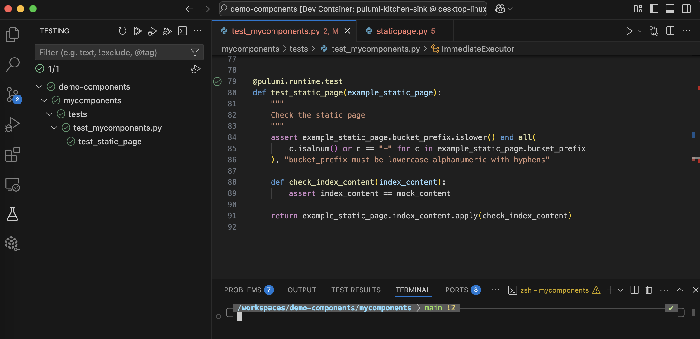

# Pulumi components with python

An opinionated dev setup for building and testing pulumi component resources with python, *properly*.

Currently, to develop Pulumi components with python is to walk a poorly marked trail. Step off the path, and you quickly get lost. Hopefully, this helps you find your way!

### Prerequisites
 - Docker
 - vscode and devcontainers extension
 - set environment variable GITHUB_USERNAME on the host machine, which is used to build the devcontainer
 - chezmoi for syncing your dotfiles into the dev container
 - an aws account, and you can log into the aws cli (e.g. with `aws sso login`)
 - a pulumi cloud account

### What's in the box
- Python tools: poetry, pytest, black, debugpy, flake8
- Pulumi tools: based on `pulumi/pulumi:latest`, includes all supported languages (needed for generating pulumi sdks) and pulumi-ctl. Don't try and install all these yourself :sweat-smile:
- vscode extensions for the above
- An example component resource and program that deploys it. It just creates a static web page on s3.
- Tests with pytest (you'll probably find `poetry run pytest -v -x --log-cli-level=DEBUG --log-level=DEBUG` useful)

### Issues and workarounds
 So far, I've identified the following quirks;
- flaky pytests that sometimes hang indefinitely with `pulumi.runtime.Mock`, due to threading (see [#7663](https://github.com/pulumi/pulumi/issues/7663#issuecomment-2828721990))


## Preview :heart:
### Vscode with devcontainer, zsh, pytest and debugger setup


### Pulumi stack from example program
```
Current stack is dev:
    Owner: XXX
    Last updated: 49 seconds ago (2025-04-25 10:01:06.368746303 +0000 UTC)
    Pulumi version used: v3.163.0
Current stack resources (11):
    TYPE                                                                       NAME
    pulumi:pulumi:Stack                                                        my-static-page-dev
    ├─ pulumi:providers:mycomponents                                           default
    ├─ mycomponents:index:StaticPage                                           myPage
    │  └─ aws:s3/bucketV2:BucketV2                                             myPage-bucket
    │     ├─ aws:s3/bucketOwnershipControls:BucketOwnershipControls            myPage-BucketOwnershipControls
    │     ├─ aws:s3/bucketPublicAccessBlock:BucketPublicAccessBlock            myPage-BucketPublicAccessBlock
    │     ├─ aws:s3/bucketObject:BucketObject                                  myPage-index-object
    │     ├─ aws:s3/bucketPolicy:BucketPolicy                                  myPage-bucket-policy
    │     ├─ aws:s3/bucketWebsiteConfigurationV2:BucketWebsiteConfigurationV2  myPage-BucketWebsiteConfigurationV2
    │     └─ aws:s3/bucketAclV2:BucketAclV2                                    myPage-BucketAclV2
    └─ pulumi:providers:aws                                                    default_6_77_1

Current stack outputs (1):
    OUTPUT      VALUE
    websiteUrl  mypage-XXX.s3-website.eu-north-1.amazonaws.com
```

<hr>

## Background - when and why this repo was made (April 2025)
I'm setting up to implement [a minimal data platform](https://honestgrowth.super.site/essays/designing-the-marketplace), and think that pulumi is a great candidate for handling self service infrastructure.

Pulumi component resources are an important abstraction that we want to extend across languages.

Previously, the only way to share these components was to develop a provider.
Pulumi offers boilerplate repos for each authoring language (see for example python's [pulumi-component-provider-py-boilerplate](https://github.com/pulumi/pulumi-component-provider-py-boilerplate)).
Peeking into the Makefile, you can quickly see that building SDKs for every supported language is complex, fragile, and unfortunately not hidden away from the author.

I gave this a bash [here](https://github.com/jaketbouma/pulumi-shopkeeper/tree/main/provider/cmd/pulumi-resource-shopkeeper/shopkeeper_provider). Expecting to take the python project pretty far along, I wanted to ensure that I could develop with more modern python tooling i.e. poetry and pytest. Trying to shift the python boilerplate repo from pip to poetry, I got lost in a swamp of `cd`, `cp`, `mv` and makefile targets.

I gave up when I heard that this is getting a major overhaul, right before the [announcement of pulumi components](https://www.pulumi.com/blog/pulumi-components/). What they have done with the "next generation of Pulumi components" is open up another path for sharing components across languages, where the user of the package builds the SDK in the language they're using. Pulumi of course hides the build process away from the user.

That's a bit expensive for the user, but nice rapid development. Hopefully, this is a step towards a simpler build process for providers, so that we can pay for the build process up front and for everybody.

Today (22/04/2025), we have a nice [blog post on building components](https://www.pulumi.com/docs/iac/using-pulumi/extending-pulumi/build-a-component/), but given that it's new, and that it's not including Poetry, I thought to take it for a spin.

In this repo my aim is to:
1. Build a silly component resource
2. Use poetry, no requirements and no pip
3. Write tests with pytest
4. Use the component resouce in another pulumi project
